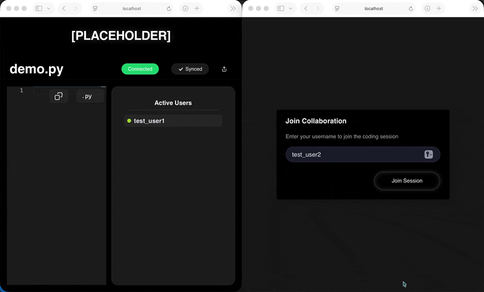

# Collaborative Code Editor kinda?

A real-time collaborative code editor backend written in Go.
Provides a WebSocket server for low-latency collaborative editing plus HTTP endpoints for basic document management.

Deployed on Render for now: https://codellab-editor.onrender.com



## Features

- **Real-time Collaboration**: Multiple users can edit the same document simultaneously
- **WebSocket Communication**: Low-latency real-time updates
- **Document Management**: Create, read, update, and delete documents
- **User Sessions**: Track active users in each room
- **RESTful API**: HTTP endpoints for document management
- **Language Support**: Specify programming language for syntax highlighting
- **User Presence**: Real-time user presence tracking in each room

## Architecture

### Backend (Go)
- **WebSocket Server**: Handles real-time communication
- **Room Management**: Manages collaborative editing sessions
- **Document Storage**: PostgreSQL database persistence
- **Operation Broadcasting**: Distributes text operations to all clients

### Key Components

1. **Room Manager**: Manages collaborative editing rooms and user presence
2. **Document Store**: PostgreSQL-based document persistence
3. **WebSocket Handler**: Manages real-time connections with user authentication
4. **Operation System**: Handles text operations (insert, delete, retain)

## Project Structure

```
collab-editor/
├── main.go
├── go.mod
├── .env.example
├── app/
├── pkg/
│   ├── config/
│   ├── handlers/
│   ├── room/
│   └── db/
├── scripts/
│   └── setup-db.sh
└── test_client.html
```

## API Endpoints

### WebSocket
- `WS /ws/{roomId}` - Connect to a collaborative room (requires username)

### REST API
- `POST /api/documents` - Create a new document
- `GET /api/documents` - List all documents
- `GET /api/documents/{id}` - Get a document by ID
- `PATCH /api/documents/{id}` - Update document metadata (title, language)
- `DELETE /api/documents/{id}` - Delete a document
- `GET /api/rooms/{roomId}/users` - Get users in a room

**Note**: Document content can only be updated via WebSocket operations for real-time collaboration.

## Configuration

The application supports configuration through environment variables or a `.env` file. Copy `.env.example` to `.env` and modify as needed.

### Available Configuration Options:

| Variable      | Default         | Description                      |
| ------------- | --------------- | -------------------------------- |
| `SERVER_HOST` | `localhost`     | Server host                      |
| `SERVER_PORT` | `8080`          | Server port                      |
| `DB_HOST`     | `localhost`     | PostgreSQL host                  |
| `DB_PORT`     | `5432`          | PostgreSQL port                  |
| `DB_USER`     | `postgres`      | PostgreSQL username              |
| `DB_PASSWORD` | `postgres`      | PostgreSQL password              |
| `DB_NAME`     | `collab_editor` | Database name                    |
| `DB_SSLMODE`  | `disable`       | SSL mode for database connection |

## Getting Started

1. **Install Dependencies**:
   ```bash
   go mod tidy
   ```

2. **Setup PostgreSQL Database**:
   ```bash
   # Install PostgreSQL (if not already installed)
   brew install postgresql
   
   # Create database
   createdb collab_editor
   
   # Run migrations (from scripts directory)
   ./setup-db.sh
   ```

3. **Run the Server**:
   ```bash
   go run main.go
   ```

4. **Connect via WebSocket**:
   ```javascript
   // Connect with username 
   const ws = new WebSocket('ws://localhost:8080/ws/room123');
   
   // Send init message with username
   ws.onopen = () => {
     ws.send(JSON.stringify({
       type: 'init',
       username: 'YourName'
     }));
   };
   ```

## WebSocket Message Format

### Client to Server Messages

```json
{
  "type": "init",
  "username": "UserName"
}

{
  "type": "operation",
  "operation": {
    "type": "insert",
    "position": 10,
    "content": "Hello",
    "length": 0,
    "client_id": "client123",
    "timestamp": 1234567890
  }
}

{
  "type": "metadata",
  "title": "New Title",
  "language": "python"
}
```

### Server to Client Messages

```json
{
  "type": "snapshot",
  "content": "document content",
  "users": [
    {"id": "user1", "username": "Alice"},
    {"id": "user2", "username": "Bob"}
  ]
}

{
  "type": "user_joined",
  "user": {"id": "user3", "username": "Charlie"}
}

{
  "type": "user_left",
  "user": {"id": "user1"}
}

{
  "type": "operation",
  "operation": {
    "type": "insert",
    "position": 10,
    "content": "Hello",
    "length": 0,
    "client_id": "client123",
    "timestamp": 1234567890
  }
}

{
  "type": "metadata_update",
  "title": "New Title",
  "language": "python"
}
```